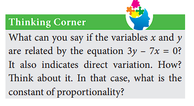
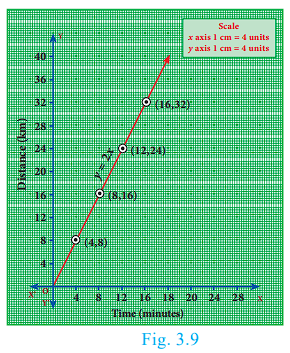
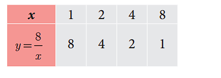
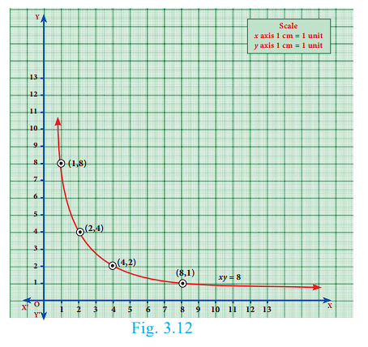
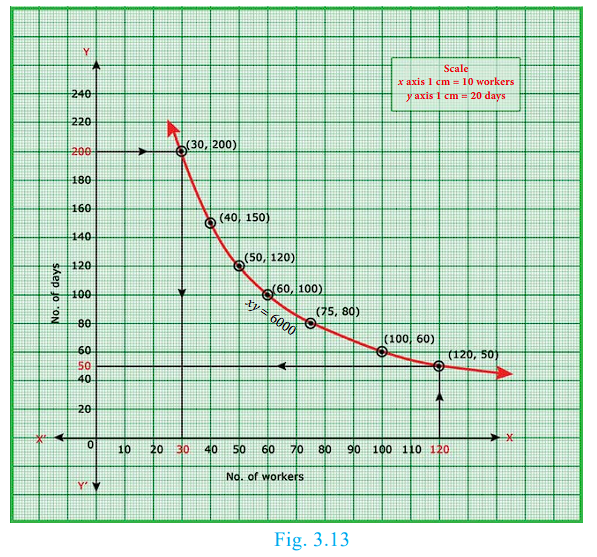


# Graph of Variations

**Variables:**
Every day, Harini travels from her home, cycling at a uniform speed, to reach her school. You can state this mathematically by an equation d = rt, where d stands for distance travelled at any time t and r is the uniform rate of speed.

Suppose you want to find the distance covered by her at a speed of 20 km per hour when she has cycled for fifteen minutes r = 20 and t=\\(\frac{1}{4}\\) (how?) and we find d to be rt = 20 ×\\(\frac{1}{4}\\)=5km

Here, we say that d is a dependent variable and r and t are independent variables. As the distance d travelled upon the rate r and time used t.

Thus, an independent variable represents a quantity that is manipulated in a given situation where as a dependent variable represents a quantity whose value depends on how the independent variable is manipulated.

Equations that describe the relationship between two variables in a sentence express the variation between those variables.
Consider the monthly income of Server Suresh who works in a hotel
where he is paid 50  per hour.

There are two variables here. One is the monthly income and the other is the number of hours he works. Which among the two is the independent variable?

**Constants:**
You know how to calculate the area of a circle when the length of its radius is given.
If the area required is A and the length of radius is r, then the formula \\(A=\Pi r^2\\)
gives the required result. Here, the area A depends upon the length r of radius; thus A is a dependent variable and r is the independent variable. But what can we say about \\(\pi\\)? It is a number that remains the same in all the situations. It is constant.

A constant is a quantity that assumes a fixed value throughout in a specific mathematical context.

**Two types of variation:**
When two things are in proportion, there is a relation
between them, due to which, if the value of one of them
changes, the value of the other also changes. We look into
two types of variations here:
(i) Direct variation
(ii) Indirect variation.

1. Direct variation:
When you go to the market, to buy more apples, you’ll
have to spend more amount of money. If the cost of one kg
of apples is ₹ 200, you pay as follows:

You find that \\(\frac{1}{200}=\frac{2}{400}=\frac{3}{600}=\frac{4}{800}=\frac{5}{1000}\\)

This kind of proportionate variation is known as Direct variation. Here to find the cost, the weight is multiplied by the constant 200. If we denote the variable weight as x and the variable cost as y we can express this algebraically as y = 200x. The multiplying constant here is 200.

**Visualising Direct variation:**
To identify direct variation is to look 
at the equation and determine if it is of 
the form y = kx, where k is the constant of 
proportionality. Thus, an equation like y = 5x
will always indicate direct proportion among 
variables

**Observe this graph:**
The distance travelled and the time taken are proportional, but how do we know that?
Note that 
i. The graph is a straight line.
ii. The line passes through the origin. When both of these 
features are present we know that the two quantities on 
the graph must be directly proportional. 
Do you see this in the graph?

If one variable doubles, the other also doubles. From this you can see the relation d = rt and it is easy to guess the constant of proportionality. 

**Example 3.47** Varshika drew 6 circles with different sizes. Draw a graph for the relationship between the diameter and circumference (approximately related) of each circle as shown in the table and use it to find the circumference of a circle when its diameter is 6 cm.

**Solution:**
From the table, we found that as x increses,
y also increases. Thus, the variation is a direct 
variation.
Let y = kx,where k is a constant of proportionality.
From the given values, we have

\\(k=\frac{3.1}{1}=\frac{6.2}{2}=\frac{9.3}{3}=\frac{12.4}{4}=...=3.1\\)

When you plot the points (1, 3.1) (2, 6.2) 
(3, 9.3), (4, 12.4), (5, 15.5), you find the relation 
y = (3.1)x forms a straight-line graph. 
Clearly, from the graph, when diameter is 6 cm, 
its circumference is 18.6 cm

**Example 3.48** A bus is travelling at a uniform speed of 50 km/hr. Draw the distance-time graph and hence find 
(i) the constant of variation
(ii) how far will it travel in 90 minutes?
(iii) the time required to cover a distance of 300 km from the graph.
**Solution**
Let x be the time taken in minutes and y be the distance travelled in km

(i) Observe that as time increases, the distance travelled also increases. Therefore, the 
variation is a direct variation. It is of the form y=kx.

 Constant of variation 

 \\(k=\frac{y}{x}=\frac{50}{60}=\frac{100}{120}=\frac{150}{180}=\frac{200}{400}=\frac{5}{6}\\)

 Hence, the relation may be given as
 \\(y=kx =>y=\frac{5}{6}x\\)

 (ii) From the graph,\\(y=\frac{5x}{6}\\) if x = 90 , 
    then \\(y=\frac{5}{6}\\)x90=75km
 The distance travelled for 90 minutes 
is 75 km. 
(iii) From the graph,\\(y=\frac{5x}{6}\\) if y = 300 
 then \\(x=\frac{6y}{5}=\frac{6}{5}\\)x300=360 minutes 
 (or) 6 hours.

 The time taken to cover 300 km is 
360 minutes (or) 6 hours. 

**(ii) Indirect variation:**
The distance between Chennai and Madurai is (nearly) 480 km. Think of a train that starts from Chennai and travels towards Madurai. As it increases speed more and more, the time taken for travel will decrease. In the following table speed v is given in km and time t is given in hours:

From the table it is clear that if you travel at a slower speed, the time increases and if thtrain is faster, the time decreases. You find, 30×16 = 40×12 = 60×8 = 80×6, which tells that vt is a constant. Here vt = 480. In such a case, we say the variables v and t are inversely proportional. Observe that the graph of equation like vt = 480 will not be a straight line. Inverse variation implies that as one variable increases,the other variable decreases.

**Visualising Indirect variation:**
Look at the adjacent graph. It is a graph of the equation xy = 8. We have taken only the positive values of x, y.
The table of values is:

This is an illustration of inverse variation or indirect variation. The graph is a part of a curve called Rectangular Hyperbola.

**Example 3.49** A company initially started with 40 workers to complete the work by 150 days. Later, it decided to fasten up the work increasing the number of workers as shown below.

(i) Graph the above data and identify the type of variation.
(ii) From the graph, find the number of days required to complete the work if the company decides to opt for 120 workers?
(iii) If the work has to be completed by 200 days, how many workers are required?

From the given table, we observe that as x increases, y decreases. Thus, the variation is an inverse variation.
Let \\(y=\frac{k}{z}\\)
⇒ xy=k, k>0  is called the constant of variation.
From the table, k=40x150=50x120= ... =75x80=6000
Therefore, xy = 6000
Plot the points (40,150), (50,120), (60,100) of (75,80) and join to get a free hand smooth curve (Rectangular Hyperbola).

(ii) From the graph, the required number of days to complete the work when the company decides to work with 120 workers is 50 days. 

Also, from xy = 6000 if x = 120 , then y=\\(\frac{6000}{120}\\)=50

(iii) From the graph, if the work has to be completed by 200 days, the number of workers required is 30.
 Also, from xy = 6000 if y = 200, then x=\\(\frac{6000}{200}\\)=30

 **Example 3.50**
Nishanth is the winner in a Marathon race of 12 km distance. He ran at the uniform speed of 12 km/hr and reached the destination in 1 hour. He was followed by Aradhana,Jeyanth, Sathya and Swetha with their respective speed of 6 km/hr, 4 km/hr, 3 km/hr and 2 km/hr. And, they covered the distance in 2 hrs, 3 hrs, 4 hrs and 6 hours respectively.
Draw the speed-time graph and use it to find the time taken to Kaushik with his speed of 2.4 km/hr.
Solution: Let us form the table with the given details.

From the table, we observe that as x decreases, y increases. Hence, the type is 
**inverse variation**
Let \\(y=\frac{k}{z}\\)
⇒ xy=k, k>0  is called the constant of variation.
From the table, k=12x1=6x2=2x6=12
Therefore, xy = 12.
Plot the points (12,1), (6,2), (4,3),(3,4), (2,6) and join these points by a smooth curve (Rectangular Hyperbola).
From the graph, we observe that Kaushik takes 5 hrs with a speed of 2.4 km/hr.

1. A garment shop announces a flat 50% discount on every purchase of items for their customers. Draw the graph for the relation between the Marked Price and the Discount.
Hence find
(i) the marked price when a customer gets a discount of ₹3250 (from graph)
(ii) the discount when the marked price is ₹2500
2. Draw the graph of xy = 24, x,y > 0. Using the graph find,
 (i) y when x =3 and (ii) x when y = 6.
3. Graph the following linear function y=\\(\frac{1}{2}x\\) Identify the constant of variation and verify it with the graph. Also (i) find y when x = 9 (ii) find x when y = 7.5.
4. The following table shows the data about the number of pipes and the time taken to fill the same tank.

Draw the graph for the above data and hence
(i) find the time taken to fill the tank when five pipes are used
(ii) Find the number of pipes when the time is 9 minutes.
5. A school announces that for a certain competitions, the cash price will be distributed
for all the participants equally as show below

(i) Find the constant of variation.
(ii) Graph the above data and hence, find how much will each participant get if the number of participants are 12.
6. A two wheeler parking zone near bus stand charges as below.

Check if the amount charged are in direct variation or in inverse variation to the parking time. Graph the data. Also (i) find the amount to be paid when parking time is 6 hr; (ii) find the parking duration when the amount paid is ₹150.

