# Area of Quadrilatral

>If ABCD is a quadrilateral, then considering the diagonal AC, we can split the quadrilateral ABCD into two triangles ABC and ACD.

>Using area of triangle formula given its vertices, we can calculate the areas of triangles ABC and ACD.

>Now, Area of the quadrilateral ABCD = Area of triangle ABC + Area of triangle ACD >We use this information to find area of a quadrilateral when its vertices are given.

>Let  be the A (*x*1,*y*1), B(*x*2,*y*2), C(*x*3,*y*3) and D(*x*4,*y*4)
vertices of a quadrilateral ABCD.

>Now, Area of quadrilateral ABCD
= Area of the DABD +Area of the DBCD (Fig 5.9)

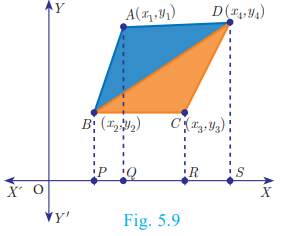

>The following pictorial representation helps us to write the above formula very easily. Take the vertices A (*x*1,*y*1), B(*x*2,*y*2), C(*x*3,*y*3) and D(*x*4,*y*4) in counter-clockwise direction and write them column-wise as that of the area of a triangle

>
**Thinking Corner**

>If the area of a quadrilateral formed by the points (a, a), (–a, a), (a, –a) and (–a, –a), where a ¹ 0 is 64 square units, then identify the type of the quadrilateral

>Find all possible values of a.

<b>Example 5.1</b> Find the area of the triangle whose vertices are (-3,5), (5,6) and (5,-2)

<b>Solution</b> Plot the points in a rough diagram and take them in counter-clockwise order

>Let the vertices be A(-3,5), B(5,-2), C(5,6)

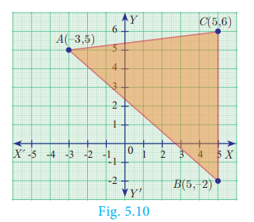

<b>Example 5.2</b> Show that the points P(-1.5,3), Q(6,-2), R(-3,4) are collinear.

<b>Solution</b> The points are P(-1.5,3), Q(6,-2), R(-3,4)

Therefore, the given points are collinear.

<b>Example 5.3</b> If the area of the triangle formed by the vertices A(-1,2), B (k,-2) and C(7,4) (taken in order) is 22 sq. units, find the value of k.

<b>Solution</b> The vertices are A(-1,2), B(k,-2) and C(7,4)
Area of triangle ABC is 22 sq.units

<b>Example 5.4</b> If the points P(-1,-4), Q(b,c) and R(5,-1) are collinear and if 2b+c=4 , 
then find the values of b and c

<b>Solution</b> Since the three points P(-1,-4), Q(b,c) and R(5,-1) are collinear,

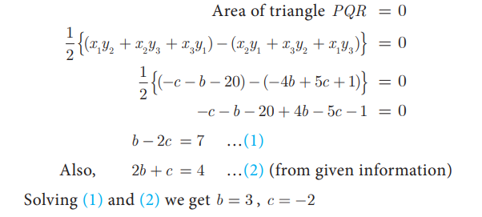

<b>Example 5.5</b> The floor of a hall is covered with identical tiles which are in the shapes of triangles. One such triangle has the vertices at (-3,2), (-1,-1) and (1,2). If the floor of the hall is completely covered by 110 tiles, find the area of the floor.

<b>Solution</b> Vertices of one triangular tile are at 
 (-3,2), (-1,-1) and (1,2)

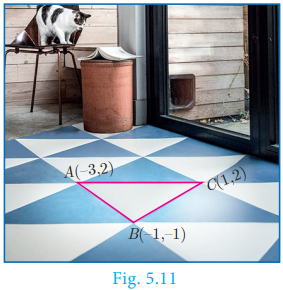
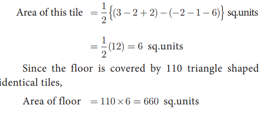

<b>Example 5.6</b> Find the area of the quadrilateral formed by the points (8,6), (5,11), (-5,12) and (-4,3).

<b>Solution</b> Before determining the area of quadrilateral, plot the vertices in a graph. Let the vertices be A(8,6), B(5,11), C(–5,12) and D(–4,3) Therefore, area of the quadrilateral ABCD

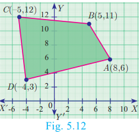

# process Check

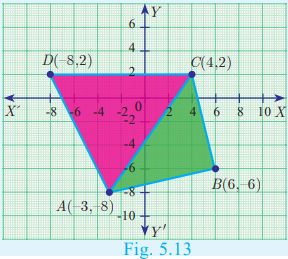

Given a quadrilateral ABCD with vertices A(–3,–8), B(6,–6), C(4,2), D(–8,2)

-   Find the area of ABC .

-   Find the area of ACD .

-   Calculate area of ABC + area of ACD .

-   Find the area of quadrilateral ABCD. 

-   Compare the answers obtained in 3 and 4.

<b>Example 5.7</b> The given diagram shows a plan for constructing a new parking lot at a campus. It is estimated that such construction would cost `1300 per square feet. What will be the total cost for making the parking lot?

<b>Solution</b> The parking lot is a quadrilateral whose vertices are at A(2,2), B(5,5), C(4,9) and D(1,7).

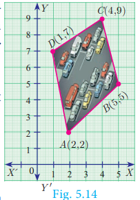
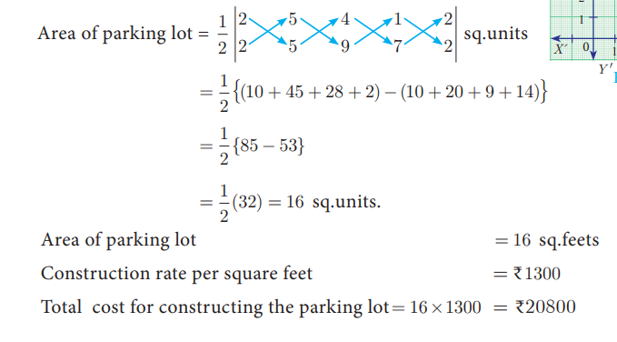

Activity 1
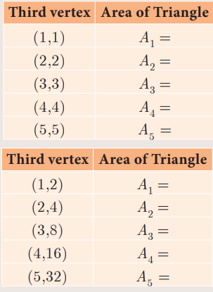

-    Take a graph sheet.

-    Consider a triangle whose base is the line joining the points (0,0) and (6,0)

-    Take the third vertex as (1,1), (2,2), (3,3), (4,4),(5,5) and find their areas.Fill in the details given.

-    Do you see any pattern with A1, A2, A3, A4, A5 ? If so mention it.

-    Repeat the same process by taking third vertex in step (iii) as (1,2), (2,4), (3,8), 
(4,16), (5,32).

-     Fill the table with these new vertices.

-     What pattern do you observe now withA1, A2, A3, A4, A5?

Activity 2

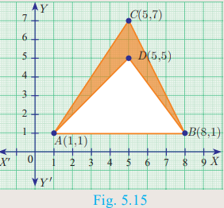 Find the area of the shaded region

<h3>Exercise 5.1 </h3>

1. Find the area of the triangle formed by the points

>(i) (1,–1), (–4, 6) and (–3, –5) (ii) (–10, –4), (–8, –1) and (–3, –5)

2. Determine whether the sets of points are collinear?

3. Vertices of given triangles are taken in order and their areas are provided aside. In each case, find the value of ‘p ’.

4. In each of the following, find the value of ‘a’ for which the given points are collinear.

>(i) (2, 3), (4, a) and (6, –3) (ii) (a, 2–2a), (–a+1, 2a) and (–4–a, 6–2a)

5. Find the area of the quadrilateral whose vertices are at

>(i) (–9, –2), (–8, –4), (2, 2) and (1, –3) (ii) (–9, 0), (–8, 6), (–1, –2) and (–6, –3)

6. Find the value of k, if the area of a quadrilateral is 28 sq.units, whose vertices are taken in the order (–4, –2), (–3, k), (3, –2) and (2, 3) 

7. If the points A( , -3 9), B a( ,b) and C( , 4 5 - ) are collinear and if a b + = 1 , then find a and b.

8. Let P(11,7), Q( 13.5,) and R(9.5,)4 be the midpoints of the sides AB, BC and AC respectively of ABC . Find the coordinates of the vertices A, B and C. Hence find the area of DABC and compare this with area of PQR .

9. In the figure, the quadrilateral swimming pool shown is surrounded by concrete patio. Find the area of the patio

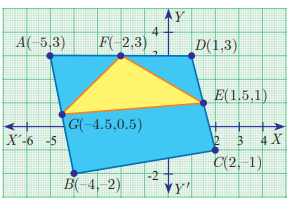

10. A triangular shaped glass with vertices at A(-5,-4), B(1,6) and C(7,-4) has to be painted. If one bucket of paint covers 6 square feet, how many buckets of paint will be required to paint the whole glass, if only one coat of paint is applied.

11. In the figure, find the area of (i) triangle AGF (ii) triangle FED (iii) quadrilateral BCEG.

