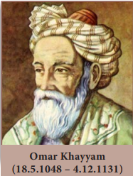


# Geometry

 

Omar Khayyam was a Persian mathematician, astronomer and poet. As a poet, his classic work Rubaiyat attained world fame.

Khayyam's work is an effort to unify Algebra and Geometry. Khayyam's work can be considered the first systematic study and the first exact method of solving cubic equations. He accomplished this task using Geometry. His efforts in trying to generalize the principles of Geometry provided by Euclid, inspired many European mathematicians to the eventual discovery of non-Euclidean Geometry. Khayyam was a perfect example of being a notable scientist and a great poet, an achievement which many do not possess.

 **Learning Outcomes**

* To recall congruent triangles and understand the 
definition of similar triangles.
* To understand the properties and construction of similar triangles and 
apply them to solve problems.
* To prove basic proportionality theorem, angle bisector theorem and 
study their applications and study the construction of triangles under 
given conditions.
* To prove Pythagoras theorem and study its applications.
* To understand the concept of tangent to a circle and study construction 
of tangent to circle.
* To understand and apply concurrency theorems.

## Introduction

The study of Geometry is concerned with knowing properties of various shapes and structures. Arithmetic and Geometry were considered to be the two oldest branches of mathematics. Greeks held Geometry in high esteem and used its properties to discuss various scientific principles which otherwise would have been impossible. Eratosthenes used the similarity of circle to determine the circumference of the Earth, distances of the moon and the sun from the Earth, to a remarkable accuracy. Apart from these achievements, similarity is used to find width of rivers, height of trees and much more.

In this chapter, we will be discussing the concepts mainly as continuation of previous classes and discuss most important concepts like Similar Triangles, Basic Proportionality Theorem, Angle Bisector Theorem, the most prominent and widely acclaimed Pythagoras Theorem and much more. Ceva's Theorem and Menelaus Theorem is introduced for the first time. These two new theorems generalize all concurrent theorems that we know. Overall, the study of Geometry will create interest in the deep understanding of objects around us.

Geometry plays vital role in the field of Science, Engineering and Architecture. We see many Geometrical patterns in nature. We are familiar with triangles and many of their properties from earlier classes.
