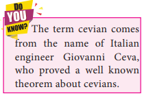
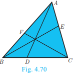
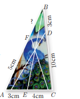
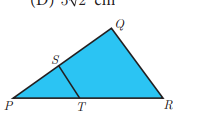
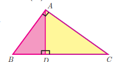
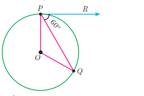
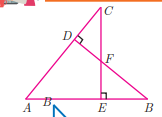
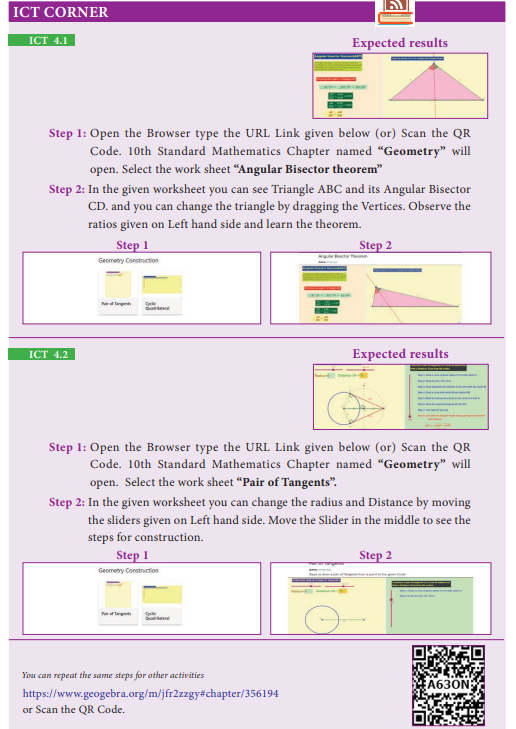



# Geometry

## Concurrency Theorems

Definition

A cevian is a line segment that extends from one vertex of a triangle to the opposite side. In the diagram, AD is a cevian, from \\(A\\).

**Special cevians**

1. A median is a cevian that divides the opposite side into two congruent(equal) lengths.
2. An altitude is a cevian that is perpendicular to the opposite side.
3. An angle bisector is a cevian that bisects the corresponding angle.

**Ceva's Theorem (without proof)**

**Statement**

Let \\(\mathrm{ABC} be a triangle and let D, E, F be points on lines B C, C A, A B respectively. Then the cevians A D, B E, C F are concurrent if and only if \frac{B D}{D C} \times \frac{C E}{E A} \times \frac{A F}{F B}=1\\) where the lengths are directed. This also works for the reciprocal of each of the ratios as the reciprocal of 1 is 1 .

**Note**

The cevians do not necessarily lie within the triangle, although they do in the diagram.

**Menelaus Theorem (without proof) Statement**

A necessary and sufficient condition for points \\(P, Q, R on the respective sides \mathrm{BC}, C A, A B (or their extension) of a triangle A B C to be collinear is that \frac{B P}{P C} \times \frac{C Q}{Q A} \times \frac{A R}{R B}=-1\\) where all segments in the formula are directed segments.

**Note**

Menelaus theorem can also be given as \\(B P \times C Q \times A R=-P C \times Q A \times R B\\).

If \\(\mathrm{BP} is replaced by P B (or) C Q by Q C (or) A R by R A, or if any one of the six directed line segments B P, P C, C Q, Q A, A R, R B\\) is interchanged, then the product will be 1 .

**Example 4.32** Show that in a triangle, the medians are concurrent. 

**Solution** Medians are line segments joining each vertex to the midpoint of the corresponding opposite sides.

Thus medians are the cevians where \\(D, E, F are midpoints of B C, C A and A B\\) respectively.

Since \\(D is a midpoint of B C, B D=D C so \frac{B D}{D C}=1\\)

Since, \\(E is a midpoint of C A, C E=E A so \frac{C E}{E A}=1 \ldots\\)

Since, \\(F is a midpoint of A B, A F=F B so \frac{A F}{F B}=1\\)

Thus, multiplying (1), (2) and (3) we get,

\\(\frac{B D}{D C} \times \frac{C E}{E A} \times \frac{A F}{F B}=1 \times 1 \times 1=1\\)

And so, Ceva's theorem is satisfied.
Hence the Medians are concurrent.

**Example 4.33** In \\(\triangle A B C, points D, E, F lies on B C, C A, A B respectively. Suppose A B, A C and B C have lengths 13,14 and 15 respectively. If \frac{A F}{F B}=\frac{2}{5} and \frac{C E}{E A}=\frac{5}{8}. Find B D and D C\\).

**Solution** Given that \\(A B=13, A C=14 and B C=15\\).

Let \\(B D=x and D C=y\\)

Using Ceva's theorem, we have, \\(\frac{B D}{D C} \times \frac{C E}{E A} \times \frac{A F}{F B}=1\\)

Substitute the values of \\(\frac{A F}{F B} and \frac{C E}{E A}\\) in (1),

we have \\(\frac{B D}{D C} \times \frac{5}{8} \times \frac{2}{5}=1\\)

\\(\begin{aligned}
& \frac{x}{y} \times \frac{10}{40}=1 \text { we get, } \frac{x}{y} \times \frac{1}{4}=1 . \text { Hence, } x=4 y 
& B C=B D+D C=15 \text { so, } x+y=15
\end{aligned}\\)

From (2), using \\(x=4 y in (3) we get, 4 y+y=15 gives 5 y=15 then y=3\\)

Substitute \\(y=3 in (3) we get, x=12. Hence B D=12, D C=3\\).

**Example 4.34** In a garden containing several trees, three particular trees \\(P, Q, R are located in the following way, B P=2 \mathrm{~m}, C Q=3 \mathrm{~m}, R A=10 \mathrm{~m}, P C=6 \mathrm{~m}, Q A=5 \mathrm{~m}, R B=2 \mathrm{~m}, where A, B, C are points such that P lies on B C, Q lies on A C and R lies on A B. Check whether the trees \mathrm{P}, Q, R\\) lie on a same straight line.

**Solution** By Meanlau's theorem, the trees \\(P, Q, R\\) will be collinear (lie on same straight line)

\\(\text { if } \frac{B P}{P C} \times \frac{C Q}{Q A} \times \frac{R A}{R B}=1\\)

Given \\(B P=2 \mathrm{~m}, C Q=3 \mathrm{~m}, R A=10 \mathrm{~m}, P C=6 \mathrm{~m}, Q A=5 \mathrm{~m} and R B=2 \mathrm{~m}\\)

Substituting these values in (1) we get, \\(\frac{B P}{P C} \times \frac{C Q}{Q A} \times \frac{R A}{R B}=\frac{2}{6} \times \frac{3}{5} \times \frac{10}{2}=\frac{60}{60}=1\\)

Hence the trees \\(\mathrm{P}, Q, R\\) lie on a same straight line.

**Excercise 4.4**

1. The length of the tangent to a circle from a point P, which is 25 cm away from the 
centre is 24 cm. What is the radius of the circle?
2. ∆LMN is a right angled triangle with ∠L = 90°. A circle is inscribed in it. The 
lengths of the sides containing the right angle are 6 cm and 8 cm. Find the radius of 
the circle.

4. \\(P Q is a tangent drawn from a point P to a circle with centre O and Q O R is a diameter of the circle such that \angle P O R=120^{\circ}. Find \angle O P Q\\).

5. A tangent \\(S T to a circle touches it at B . A B is a chord such that \angle A B T=65^{\circ}. Find \angle A O B, where " O\\) " is the centre of the circle.
6. In figure, \\(O is the centre of the circle with radius 5 \mathrm{~cm} . T is a point such that O T=13 \mathrm{~cm} and O T intersects the circle E, if A B is the tangent to the circle at E, find the lenght of A B\\).

7. In two concentric circles, a chord of length \\(16 \mathrm{~cm} of larger circle becomes a tangent to the smaller circle whose radius is 6 \mathrm{~cm}\\). Find the radius of the larger circle.
8. Two circles with centres \\(O and O^{\prime} of radii 3 \mathrm{~cm} and 4 \mathrm{~cm}, respectively intersect at two points P and Q, such that O P and O^{\prime} P are tangents to the two circles. Find the length of the common chord P Q\\).
9. Show that the angle bisectors of a triangle are concurrent.
10. An artist has created a triangular stained glass window and has one strip of small length left before completing the window. She needs to figure out the length of left out portion based on the lengths of the other sides as shown in the figure.
11. Draw a tangent at any point \\(R on the circle of radius 3.4 \mathrm{~cm} and centre at P\\) ?

12. Draw a circle of radius \\(4.5 \mathrm{~cm}\\). Take a point on the circle. Draw the tangent at that point using the alternate segment theorem.
13. Draw the two tangents from a point which is \\(10 \mathrm{~cm} away from the centre of a circle of radius 5 \mathrm{~cm}\\). Also, measure the lengths of the tangents.
14. Take a point which is \\(11 \mathrm{~cm} away from the centre of a circle of radius 4 \mathrm{~cm}\\) and draw the two tangents to the circle from that point.
15. Draw the two tangents from a point which is \\(5 \mathrm{~cm} away from the centre of a circle of diameter 6 \mathrm{~cm}\\). Also, measure the lengths of the tangents.
16. Draw a tangent to the circle from the point \\(P having radius 3.6 \mathrm{~cm}, and centre at O. Point P is at a distance 7.2 \mathrm{~cm}\\) from the centre.

**Exercise 4.5**

**Multiple choice questions**

1. If in triangles \\(A B C and E D F, \frac{A B}{D E}=\frac{B C}{F D}\\) then they will be similar, when
(A) \\(\angle B=\angle E\\)
(B) \\(\angle A=\angle D\\)
(C) \\(\angle B=\angle D\\)
(D) \\(\angle A=\angle F\\)
2. In \\(\triangle L M N, \angle L=60^{\circ}, \angle M=50^{\circ}. If \triangle L M N \sim \triangle P Q R then the value of \angle R\\) is
(A) \\(40^{\circ}\\)
(B) \\(70^{\circ}\\)
(C) \\(30^{\circ}\\)
(D) \\(110^{\circ}\\)
3. If \\(\triangle A B C is an isosceles triangle with \angle C=90^{\circ} and A C=5 \mathrm{~cm}, then A B\\) is
(A) \\(2.5 \mathrm{~cm}\\)
(B) \\(5 \mathrm{~cm}\\)
(C) \\(10 \mathrm{~cm}\\)
(D) \\(5 \sqrt{2} \mathrm{~cm}\\)
4. In a given figure \\(S T \| Q R, P S=2 \mathrm{~cm} and S Q=3 \mathrm{~cm}. Then the ratio of the area of \triangle P Q R to the area of \triangle P S T\\) is
(A) \\(25: 4\\)
(B) \\(25: 7\\)
(C) \\(25: 11\\)
(D) \\(25: 13\\)

5. The perimeters of two similar triangles \\(\triangle A B C and \triangle P Q R are 36 \mathrm{~cm} and 24 \mathrm{~cm} respectively. If P Q=10 \mathrm{~cm}, then the length of A B\\) is
(A) \\(6 \frac{2}{3} \mathrm{~cm}\\)
(B) \\(\frac{10 \sqrt{6}}{3} \mathrm{~cm}\\)
(C) \\(66 \frac{2}{3} \mathrm{~cm}\\)
(D) \\(15 \mathrm{~cm}\\)
6. If in \\(\triangle A B C, D E \| B C . A B=3.6 \mathrm{~cm}, A C=2.4 \mathrm{~cm} and A D=2.1 \mathrm{~cm} then the length of \mathrm{AE}\\) is
(A) \\(1.4 \mathrm{~cm}\\)
(B) \\(1.8 \mathrm{~cm}\\)
(C) \\(1.2 \mathrm{~cm}\\)
(D) \\(1.05 \mathrm{~cm}\\)
7. In a \\(\triangle A B C, A D is the bisector of \angle B A C. If A B=8 \mathrm{~cm}, B D=6 \mathrm{~cm} and D C=3 \mathrm{~cm}. The length of the side A C\\) is
(A) \\(6 \mathrm{~cm}\\)
(B) \\(4 \mathrm{~cm}\\)
(C) \\(3 \mathrm{~cm}\\)
(D) \\(8 \mathrm{~cm}\\)
8. In the adjacent figure \\(\angle B A C=90^{\circ} and $A D \perp B C\\) then
(A) \\(B D \cdot C D=B C^{2}\\)
(B) \\(A B \cdot A C=B C^{2}\\)
(C) \\(B D \cdot C D=A D^{2}\\)
(D) \\(A B \cdot A C=A D^{2}\\)

9. Two poles of heights \\(6 \mathrm{~m} and 11 \mathrm{~m} stand vertically on a plane ground. If the distance between their feet is 12 \mathrm{~m}\\), what is the distance between their tops?
(A) \\(13 \mathrm{~m}\\)
(B) \\(14 \mathrm{~m}\\)
(C) \\(15 \mathrm{~m}\\)

(D) \\(12.8 \mathrm{~m}\\)

10. In the given figure, \\(P R=26 \mathrm{~cm}, Q R=24 \mathrm{~cm}, \angle P A Q=90^{\circ}, P A=6 \mathrm{~cm} and Q A=8 \mathrm{~cm}. Find \angle P Q R\\)
(A) \\(80^{\circ}\\)
(B) \\(85^{\circ}\\)
(C) \\(75^{\circ}\\)
(D) \\(90^{\circ}\\)

11. A tangent is perpendicular to the radius at the
(A) centre
(B) point of contact
(C) infinity
(D) chord
12. How many tangents can be drawn to the circle from an exterior point?
(A) one
(B) two
(C) infinite
(D) zero
13. The two tangents from an external points \\(P to a circle with centre at O are P A and P B. If \angle A P B=70^{\circ} then the value of \angle A O B\\) is
(A) \\(100^{\circ}\\)
(B) \\(110^{\circ}\\)
(C) \\(120^{\circ}\\)
(D) \\(130^{\circ}\\)
14. In figure \\(C P and C Q are tangents to a circle with centre at O. A R B is another tangent touching the circle at R. If C P=11 \mathrm{~cm} and B C=7 \mathrm{~cm}, then the length of B R\\) is
(A) \\(6 \mathrm{~cm}\\)
(B) \\(5 \mathrm{~cm}\\)
(C) \\(8 \mathrm{~cm}\\)
(D) \\(4 \mathrm{~cm}\\)

15. In figure if \\(P R is tangent to the circle at P and O is the centre of the circle, then \angle P O Q\\) is
(A) \\(120^{\circ}\\)
(B) \\(100^{\circ}\\)
(C) \\(110^{\circ}\\)
(D) \\(90^{\circ}\\)

**Unit Exercise - 4**

1. In the figure, if \\(B D \perp A C and C E \perp A B\\), prove that
(i) \\(\triangle A E C \sim \triangle A D B\\)
(ii) \\(\frac{C A}{A B}=\frac{C E}{D B}\\)
2. In the given figure \\(A B\|C D\| E F\\).

If \\(A B=6 \mathrm{~cm}, C D=x \mathrm{~cm}, E F=4 \mathrm{~cm}, B D=5 \mathrm{~cm} and D E=y \mathrm{~cm}. Find x and y\\).
3. \\(\mathrm{O} is any point inside a triangle A B C. The bisector of \angle A O B, \angle B O C and \angle C O A meet the sides A B, B C and C A in point D\\),

 \\(E and F respectively. Show that A D \times B E \times C F=D B \times E C \times F A4. In the figure, A B C is a triangle in which A B=A C. Points D and E are points on the side A B and A C respectively such that A D=A E. Show that the points B, C, E and D\\) lie on a same circle.

5. Two trains leave a railway station at the same time. The first train travels due west and the second train due north. The first train travels at a speed of \\(20 \mathrm{~km} / \mathrm{hr} and the second train travels at 30 \mathrm{~km} / \mathrm{hr}\\). After 2 hours, what is the distance between them?
6. D is the mid point of side BC and AE ^ BC. If BC = a ,AC = b ,AB = c ,ED = x , AD = p and AE =h,prove that.
7. A man whose eye-level is 2 m above the ground wishes to find the height of a tree. 
He places a mirror horizontally on the ground 20 m from the tree and finds that if he 
stands at a point C which is 4 m from the mirror B, he can see the reflection of the 
top of the tree. How height is the tree?
8. An Emu which is 8 feet tall is standing at the foot of a pillar which is 30 feet high. It walks 
away from the pillar. The shadow of the Emu falls beyond Emu. What is the relation 
between the length of the shadow and the distance from the Emu to the pillar?
9. Two circles intersect at A and B. From a point P on one of the circles lines PAC and 
PBD are drawn intersecting the second circle at C and D. Prove that CD is parallel 
to the tangent at P.
10. Let ABC be a triangle and D,E,F are points on the respective sides AB, BC, AC (or 
their extensions). Let AD : : DB = 5 3 , BE : : EC = 3 2 and AC = 21 . Find the 
length of the line segment CF

