
# Geometry

## Thales Theorem and Angle Bisector Theorem

### Introduction

Thales, \\((640-540\\) BC (BCE)) the most famous Greek mathematician and philosopher lived around seventh century BC (BCE). He possessed knowledge to the extent that he became the first of seven sages of Greece. Thales was the first man to announce that any idea that emerged should be tested scientifically and only then it can be accepted. In this aspect, he did great investigations in mathematics and astronomy and discovered many concepts. He was credited for providing first proof in

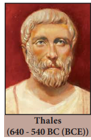

Thales (640 - 540 BC (BCE)) mathematics, which today is called by the name "Basic Proportionality Theorem". It is also called "Thales Theorem" named after its discoverer.

The discovery of the Thales theorem itself is a very interesting story. When Thales travelled to Egypt, he was challenged by Egyptians to determine the height of one of several magnificent pyramids that they had constructed. Thales accepted the challenge and used similarity of triangles to determine the

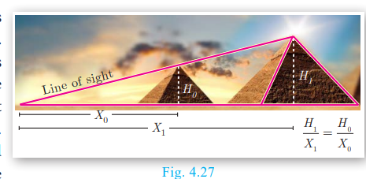

same successfully, another triumphant application of Geometry. Since \\(X_{0}, X_{1} and H_{0} are known, we can determine the height \mathrm{H}_{1}\\) of the pyramid.

To understand the basic proportionality theorem or Thales theorem, let us do the following activity.

**Activity 2**

Take any ruled paper and draw a triangle \\(A B C with its base on one of the lines. Several parallel lines will cut the triangle A B C\\).

Select any one line among them and name the points where it meets the sides \\(A B and A C as P and Q\\).

Can we find the ratio of \\(\frac{A P}{P B} and \frac{A Q}{Q C}. By measuring A P, P B, A Q and Q C through a scale, verify whether the ratios are equal or not? Try for different parallel lines, say M N and R S\\).

Now find the ratios \\(\frac{A M}{M B}, \frac{A N}{N C} and \frac{A R}{R B}, \frac{A S}{S C}\\).

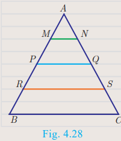

Check if they are equal? The conclusion will lead us to one of the most important theorem in Geometry, which we will discuss below.

**Theorem 1: Basic Proportionality Theorem (BPT) or Thales theorem**

**Statement**

A straight line drawn parallel to a side of triangle intersecting the other two sides, divides the sides in the same ratio.

Proof

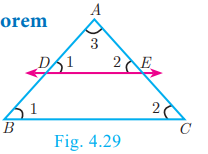

Given: In \\(\triangle A B C, D is a point on A B and E is a point on A C\\).

To prove: \\(\frac{A D}{D B}=\frac{A E}{E C}\\)

Construction: Draw a line \\(D E \| B C\\)

| No. | Statement | Reason |
| :--- | :--- | :--- |
| 1. | \\(\angle A B C=\angle A D E=\angle 1\\) | Corresponding angles are equal because D E | B C |
| 2. | \\(\angle A C B=\angle A E D=\angle 2\\) | Corresponding angles are equal because D E | B C |
| 3. | \\(\angle D A E=\angle B A C=\angle 3\\) | Both triangles have a common angle |
|  | \\(\triangle A B C \sim \triangle A D E\\) | By A A A similarity |
|  | \\(\frac{A B}{A D}=\frac{A C}{A E}\\) | Corresponding sides are proportional |  |
|  | \\(\frac{A D+D B}{A D}=\frac{A E+E C}{A E}\\) | Split A B and A C using the points D and E. |
| 4. | \\(1+\frac{D B}{A D}=1+\frac{E C}{A E}\\) | On simplification |
|  | \\(\frac{D B}{A D}=\frac{E C}{A E}\\) | Cancelling 1 on both sides |  |
|  | \\(\frac{A D}{D B}=\frac{A E}{E C}\\) | Taking reciprocals |  |

**Corollary**

If in \\(\triangle A B C, a straight line D E parallel to B C, intersects A B at D and A C at E\\), then
(i) \\(\frac{A B}{A D}=\frac{A C}{A E}\\)
(ii) \\(\frac{A B}{D B}=\frac{A C}{E C}\\).

Proof

In \\(\triangle A B C, D E \| B C\\),

Therefore, \\(\frac{A D}{D B}=\frac{A E}{E C}\\) (by Basic Proportionality Theorem)

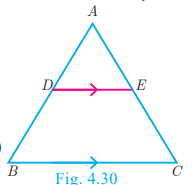

1.Taking reciprocals, we get \\(\frac{D B}{A D}=\frac{E C}{A E}\\)

2.Add 1 to both the sides

Add 1 to both in the sides \\(\frac{D B}{A D}+1=\frac{E C}{A E}+1\\)

\\(\frac{A D}{D B}+1=\frac{A E}{E C}+1\\)

\\(\frac{D B+A D}{A D}=\frac{E C+A E}{A E} so, \frac{A B}{A D}=\frac{A C}{A E}\\)

Therefore, \\(\frac{A B}{D B}=\frac{A C}{E C}\\)

Is the converse of Basic Proportionality Theorem also true? To examine let us do the following illustration.

**Illustration**

Draw an angle \\(X A Y on your notebook as shown in Fig.4.31 and on ray A X, mark points B_{1}, B_{2}, B_{3}, B_{4} and B such that A B_{1}=B_{1} B_{2}=B_{2} B_{3}=B_{3} B_{4}=B_{4} B=1 \mathrm{~cm}\\).

Similarly on ray \\(A Y, mark points C_{1}, C_{2}, C_{3}, C_{4} and C\\), such that

\\(A C_{1}=C_{1} C_{2}=C_{2} C_{3}=C_{3} C_{4}=C_{4} C=2 \mathrm{~cm}, Join B_{1} C_{1} and B C\\).

Observe that \\(\frac{A B_{1}}{B_{1} B}=\frac{A C_{1}}{C_{1} C}=\frac{1}{4} and B_{1} C_{1} \| B C\\)

Similarly joining \\(B_{2} C_{2}, B_{3} C_{3} and B_{4} C_{4}\\) you see that

\\(\begin{aligned}
& \frac{A B_{2}}{B_{2} B}=\frac{A C_{2}}{C_{2} C}=\frac{2}{3} \text { and } B_{2} C_{2} \| B C & \frac{A B_{3}}{B_{3} B}=\frac{A C_{3}}{C_{3} C}=\frac{3}{2} \text { and } B_{3} C_{3} \| B C & \frac{A B_{4}}{B_{4} B}=\frac{A C_{4}}{C_{4} C}=\frac{4}{1} \text { and } B_{4} C_{4} \| B C \end{aligned}\\)

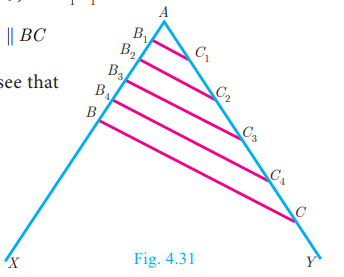
From this we observe that if a line divides two sides of a triangle in the same ratio, then the line is parallel to the third side.

Therefore, we obtain the following theorem called converse of the Thales theorem.

**Theorem 2: Converse of Basic Proportionality Theorem**

**Statement**

If a straight line divides any two sides of a triangle in the same ratio, then the line must be parallel to the third side.

Proof

Given \\(\quad : In \triangle A B C, \frac{A D}{D B}=\frac{A E}{E C}\\)

To prove \\(\quad: D E \| B C\\)

Construction : If \\(D E is not parallel to B C, draw D F \| B C\\).

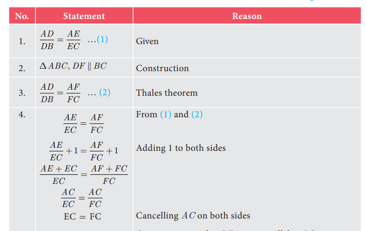

**Theorem 3: Angle Bisector Theorem**

**Statement**

The internal bisector of an angle of a triangle divides the opposite side internally in the ratio of the corresponding sides containing the angle.

**Proof**

Given : In \\(\triangle \mathrm{ABC}, \mathrm{AD}\\) is the internal bisector

To prove \\(\quad: \frac{A B}{A C}=\frac{B D}{C D}\\)

Construction : Draw a line through \\(C parallel to A B. Extend A D to meet line through C at E\\)

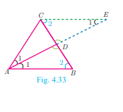

| No | Statement | Reason |
| :---: | :---: | :---: |
| 1 . | \\(\angle A E C=\angle B A E=\angle 1\\) | Two parallel lines cut by a transversal make alternate   angles equal. |
| 2. | \\(\triangle A C E is isosceles \mathrm{AC}=\mathrm{CE} \ldots(1)\\) | In \\(\triangle A C E, \angle C A E=\angle C E A\\) |
| 3. | \\(\triangle A B D \sim \triangle E C D \frac{A B}{C E}=\frac{B D}{C D}\\) | By AA Similarity |
| 4. | \\(\frac{A B}{A C}=\frac{B D}{C D}\\) | From (1) A C=C E.   Hence proved. |

**Activity 3**

Step 1: Take a chart and cut it like a triangle as shown in Fig.4.34(a).

Step 2: Then fold it along the symmetric line \\(A D. Then \mathrm{C} and \mathrm{B}\\) will be one upon the other.

Step 3: Similarly fold it along CE, then \\(B and A\\) will be one upon the other.

Step 4: Similarly fold it along BF, then \\(A and C\\) will be one upon the other.

Find \\(A B, A C, B D, D C\\) using a scale.

Find \\(\frac{A B}{A C}, \frac{B D}{D C}\\) check if they are equal?

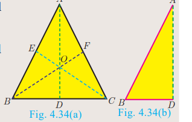

In the three cases, the internal bisector of an angle of a triangle divides the opposite side internally in the ratio of the corresponding sides containing the angle.

What do you conclude from this activity?

**Theorem 4: Converse of Angle Bisector Theorem**

**Statement**

If a straight line through one vertex of a triangle divides the opposite side internally in the ratio of the other two sides, then the line bisects the angle internally at the vertex.

Proof

Given : \\(\quad \mathrm{ABC} is a triangle. A D divides B C in the ratio of the sides containing the angles \angle A to meet B C at D\\).

That is \\(\frac{A B}{A C}=\frac{B D}{D C}\\)

To prove \\(\quad: AD bisects \angle A \quad i.e. \angle 1=\angle 2\\)

Construction : Draw \\(C E \| D A. Extend B A to meet at E\\).

**Example 4.12** In \\(\triangle A B C, if D E \| B C, A D=x, D B=x-2, A E=x+2 and E C=x-1 then find the lengths of the sides A B and A C\\).

**Solution** In \\(\triangle A B C we have D E \| B C\\).

By Thales theorem, we have \\(\frac{A D}{D B}=\frac{A E}{E C}\\)

\\(\frac{x}{x-2}=\frac{x+2}{x-1} gives x(x-1)=(x-2)(x+2)\\)

Hence, \\(x^{2}-x=x^{2}-4 so, x=4\\)

When \\(x=4, A D=4, D B=x-2=2, A E=x+2=6, E C=x-1=3\\).

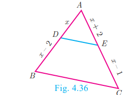

Hence, \\(A B=A D+D B=4+2=6, A C=A E+E C=6+3=9\\).

Therefore, \\(A B=6, A C=9\\).

**Example 4.13** \\(D and E are respectively the points on the sides A B and A C of a \triangle A B C such that A B=5.6 \mathrm{~cm}, \mathrm{AD}=1.4 \mathrm{~cm}, A C=7.2 \mathrm{~cm} and A E=1.8 \mathrm{~cm}, show that D E \| B C\\).

**Solution** We have \\(A B=5.6 \mathrm{~cm}, A D=1.4 \mathrm{~cm}, A C=7.2 \mathrm{~cm} and A E=1.8 \mathrm{~cm}\\).

\\(\begin{aligned}
& B D=A B-A D=5.6-1.4=4.2 \mathrm{~cm} & \text { and } E C=A C-A E=7.2-1.8=5.4 \mathrm{~cm} .& \qquad \frac{A D}{D B}=\frac{1.4}{4.2}=\frac{1}{3} \text { and } \frac{A E}{E C}=\frac{1.8}{5.4}=\frac{1}{3} & \frac{A D}{D B}=\frac{A E}{E C}\end{aligned}\\)

Therefore, by converse of Basic Proportionality Theorem, we have \\(D E is parallel to B C\\). Hence proved.

Example 4.14 In the Fig.4.38, \\(D E \| A C and D C \| A P. Prove that \frac{B E}{E C}=\frac{B C}{C P}\\).

Solution In \\(\triangle B P A, we have D C \| A P\\). By Basic Proportionality Theorem,

we have \\(\quad \frac{B C}{C P}=\frac{B D}{D A}\\)

In \\(\triangle B C A, we have D E \| A C\\). By Basic Proportionality Theorem, we have,

\\(\\)
\frac{B E}{E C}=\frac{B D}{D A}
\\(\\)

From (1) and (2) we get, \\(\frac{B E}{E C}=\frac{B C}{C P}\\). Hence proved.

**Example 4.15** In the Fig.4.39, \\(A D is the bisector of \angle A. If B D=4 \mathrm{~cm}, D C=3 \mathrm{~cm} and A B=6 \mathrm{~cm}, find A C\\).

**Solution** In \\(\triangle A B C, A D is the bisector of \angle A\\)

By Angle Bisector Theorem
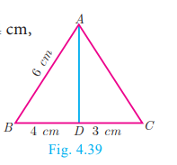

\\(\begin{aligned}
\frac{B D}{D C} & =\frac{A B}{A C} \frac{4}{3} & =\frac{6}{A C} \text { gives } 4 A C=18 . \text { Hence, } A C=\frac{9}{2}=4.5 \mathrm{~cm}\end{aligned}\\)

Example 4.16 In the Fig. 4.40, \\(A D is the bisector of \angle B A C, if A B=10 \mathrm{~cm}, A C=14 \mathrm{cm} and \mathrm{BC}=6 \mathrm{~cm}. Find B D and D C\\).

Solution Let \\(B D=x \mathrm{~cm}, then D C=(6-x) \mathrm{cm}\\)

\\(\mathrm{AD} is the bisector of \angle A\\)

By Angle Bisector Theorem

\\(\begin{aligned}
\frac{A B}{A C} & =\frac{B D}{D C} \frac{10}{14} & =\frac{x}{6-x} \quad \text { gives } \quad \frac{5}{7}=\frac{x}{6-x} 12 x & =30 \quad \text { we get, } x=\frac{30}{12}=2.5\mathrm{~cm}\end{aligned}\\)

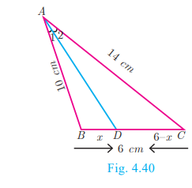

Therefore, \\(B D=2.5 \mathrm{~cm}, \quad D C=6-x=6-2.5=3.5 \mathrm{~cm}\\)

**Progress Check**

1. A straight line drawn to a side of a triangle divides the other two sides proportionally.
2. Basic Proportionality Theorem is also known as
3. Let \\(\triangle A B C be equilateral. If D is a point on B C and A D is the internal bisector of \angle A. Using Angle Bisector Theorem, \frac{B D}{D C}\\) is
4. The of an angle of a triangle divides the opposite side internally in the ratio of the corresponding sides containing the angle.
5. If the median \\(A D to the side B C of a \triangle A B C is also an angle bisector of \angle A then \frac{A B}{A C}\\) is

 **Construction of triangle**

We have already learnt in previous class how to construct triangles when sides and angles are given.

In this section, let us construct a triangle when the following are given :

1.the base, vertical angle and the median on the base

2.the base, vertical angle and the altitude on the base

3.the base, vertical angle and the point on the base where the bisector of the vertical angle meets the base.

First, we consider the following construction,

Construction of a segment of a circle on a given line segment containing an angle \\(\theta\\)

**Construction**

Step 1: Draw a line segment \\(\overline{A B}\\).

Step 2: \\(\quad At A, take \angle B A E=\theta Draw A E\\).

Step 3: Draw, \\(A F \perp A E\\).

Step 4: Draw the perpendicular bisector of \\(A B meeting A F at O\\).

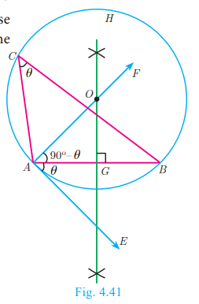

Step 5: With \\(O as centre and O A as radius draw a circle A B H\\).

Step 6: Take any point \\(C on the circle, By the alternate segments theorem, the major arc A C B is the required segment of the circle containing the angle \theta\\).

## Note

If \\(C_{1}, C_{2}, \ldots are points on the circle, then all the triangles \triangle B A C_{1}, \triangle B A C_{2}, \ldots\\) are with same base and the same vertical angle.

Construction of a triangle when its base, the vertical angle and the median from the vertex of the base are given.

Example 4.17 Construct a \\(\triangle P Q R in which P Q=8 \mathrm{~cm}, \angle R=60^{\circ} and the median R G from R to P Q is 5.8 \mathrm{~cm}. Find the length of the altitude from R to P Q\\).

**Solution**

**Construction**

Step 1: Draw a line segment \\(P Q=8 \mathrm{~cm}\\).

Step 2: At \\(P, draw P E such that \angle Q P E=60^{\circ}\\).

Step3: At \\(P, draw P F such that \angle E P F=90^{\circ}\\).

Step 4: Draw the perpendicular bisector to \\(P Q, which intersects P F at O and P Q at G\\).

Step 5: With \\(O as centre and O P\\) as radius draw a circle.

Step 6: From \\(G mark arcs of radius 5.8 \mathrm{~cm} on the circle. Mark them as R and S\\).

Step 7 : Join \\(P R and R Q. Then \triangle P Q R\\) is the required triangle .

Step 8 : From \\(R draw a line R N perpendicular to L Q. L Q meets R N at M\\)

Step 9: The length of the altitude is \\(R M=3.8 \mathrm{~cm}\\).

Note
We can get another
\\(\triangle P Q S\\) for the given
measurements.

Construct a triangle when its base, the vertical angle and the altitude from the vertex to the base are given.

Example 4.18 Construct a triangle \\(\triangle P Q R such that Q R=5 \mathrm{~cm}, \angle P=30^{\circ} and the altitude from P to Q R is of length 4.2 \mathrm{~cm}\\).

**Solution**

**Construction**

Step 1 : Draw a line segment \\(Q R=5 \mathrm{~cm}\\).

Step 2 : At \\(Q draw Q E such that \angle R Q E=30^{\circ}\\). Fig. 4.43

Step 3 : At \\(Q draw Q F such that \angle E Q F=90^{\circ}\\).

Step 4 : Draw the perpendicular bisector \\(X Y to Q R which intersects Q F at O and Q R at G\\).

Step 5 : With \\(O as centre and O Q\\) as radius draw a circle.

Step 6: From \\(G mark an arc in the line X Y at M, such that G M=4.2 \mathrm{~cm}\\).

Step 7 : Draw \\(A B through M which is parallel to Q R\\).

Step 8: \\(A B meets the circle at P and S\\).

Step 9 : Join \\(Q P and R P. Then \triangle P Q R is the required triangle. \triangle S Q R \quad\\) is another required triangle for the given measurements.
180) \\(10^{\text {th }}\\) Standard Mathematics

Construct of a triangle when its base, the vertical angle and the point on the base where the bisector of the vertical angle meets the base

**Example 4.19**  Draw a triangle \\(A B C of base B C=8 \mathrm{~cm}, \angle A=60^{\circ} and the bisector of \angle A meets B C at D such that B D=6 \mathrm{~cm}\\).

**Solution**

**Construction**

Step 1: Draw a line segment \\(B C=8 \mathrm{~cm}\\).

Step 2: At \\(B, draw B E such that \angle C B E=60^{\circ}. E \quad\\) 木

Step 3 : At \\(B, draw BF such that \angle E B F=90^{\circ}\\).

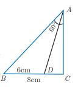

Step 4: Draw the perpendicular bisector to \\(B C, which intersects B F at O and B C at G\\).

Step 5 : With \\(O as centre and O B\\) as radius draw a circle.

Step 6 : From \\(B, mark an arc of 6 \mathrm{~cm} on B C at D\\).

Step 7 : \\(\quad\\) The perpendicular bisector intersects the circle at I. Joint ID.

Step 8: ID produced meets the circle at \\(A. Now join A B and A C. Then \triangle A B C\\) is the required triangle.

**Exercise 4.2**

1. In \\(\triangle A B C, D and E are points on the sides A B and A C respectively such that D E \| B C \quad (i) If \frac{A D}{D B}=\frac{3}{4} and A C=15 \mathrm{~cm} find A E\\).

2.If \\(A D=8 x-7, D B=5 x-3, A E=4 x-3 and E C=3 x-1, find the value of x\\).

2) ABCD is a trapezium in which \\(A B \| D C and P, Q are points on A D and B C respectively, such that P Q \| D C if P D=18 \mathrm{~cm}, B Q=35 \mathrm{~cm} and Q C=15 \mathrm{~cm}, find A D\\).
3. In \\(\triangle A B C, D and E are points on the sides A B and A C respectively. Show that D E \| B C if A B=12 \mathrm{~cm}, A D=8 \mathrm{~cm}, A E=12 \mathrm{~cm} and A C=18 \mathrm{~cm}\\).
4. In fig. if \\(P Q \| B C and P R \| C D\\) prove that

1) \\(\frac{A R}{A D}=\frac{A Q}{A B}\\)
2. \\(\frac{Q B}{A Q}=\frac{D R}{A R}\\).

5. Rhombus \\(\mathrm{PQRB} is inscribed in \triangle A B C such that \angle B is one of its angle. P, Q and R lie on A B, A C and B C respectively. If A B=12 \mathrm{~cm} and B C=6 \mathrm{~cm}, find the sides P Q, R B\\) of the rhombus.
6. In trapezium \\(A B C D, A B \| D C, E and F are points on non-parallel sides A D and B C respectively, such that E F \| A B. Show that \frac{A E}{E D}=\frac{B F}{F C}\\).
7. In figure \\(D E \| B C and C D \| E F. Prove that A D^{2}=A B \times A F\\).
8. Check whether \\(A D is bisector of \angle A of \triangle A B C\\) in each of the following

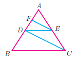

(i) \\(A B=5 \mathrm{~cm}, A C=10 \mathrm{~cm}, B D=1.5 \mathrm{~cm} and C D=3.5 \mathrm{~cm}\\).

(ii) \\(A B=4 \mathrm{~cm}, A C=6 \mathrm{~cm}, B D=1.6 \mathrm{~cm} and C D=2.4 \mathrm{~cm}\\).

9. In figure \\(\angle Q P R=90^{\circ}, \mathrm{PS}\\) is its bisector.

If \\(S T \perp P R, prove that S T \times(P Q+P R)=P Q \times P R\\).

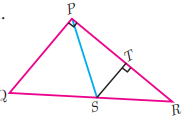

10. \\(A B C D is a quadrilateral in which A B=\mathrm{AD}, the bisector of \angle B A C and \angle C A D intersect the sides B C and C D at the points E and F respectively. Prove that E F \| B D\\).

11. Construct a \\(\triangle P Q R which the base P Q=4.5 \mathrm{~cm}, \angle R=35^{\circ} and the median R G from R to P Q is 6 \mathrm{~cm}\\).
12. Construct a \\(\triangle P Q R in which Q R=5 \mathrm{~cm}, \angle P=40^{\circ} and the median P G from P to Q R is 4.4 \mathrm{~cm}. Find the length of the altitude from P to Q R\\).
13. Construct a \\(\triangle P Q R such that Q R=6.5 \mathrm{~cm}, \angle P=60^{\circ} and the altitude from P to Q R is of length 4.5 \mathrm{~cm}\\).
14. Construct a \\(\triangle A B C such that A B=5.5 \mathrm{~cm}, \angle C=25^{\circ} and the altitude from C to A B is 4 \mathrm{~cm}\\).
15. Draw a triangle \\(A B C of base B C=5.6 \mathrm{~cm}, \angle A=40^{\circ} and the bisector of \angle A meets B C at D such that C D=4 \mathrm{~cm}\\).
16. Draw \\(\triangle P Q R such that P Q=6.8 \mathrm{~cm}, vertical angle is 50^{\circ} and the bisector of the vertical angle meets the base at D where P D=5.2 \mathrm{~cm}\\).

