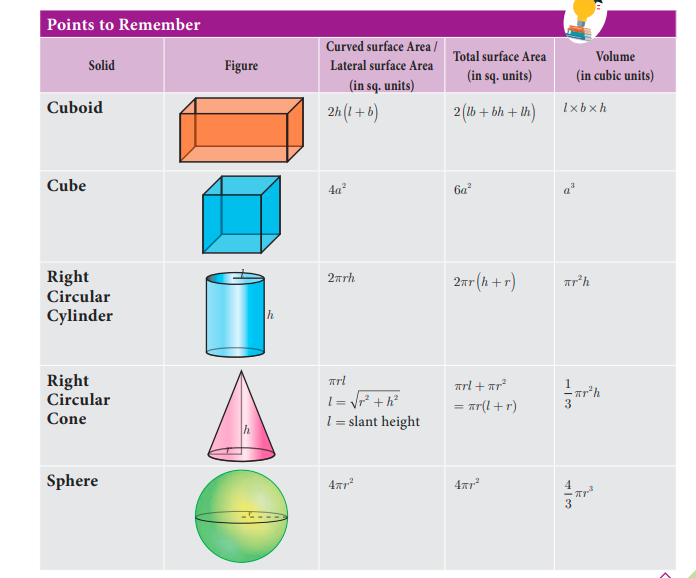
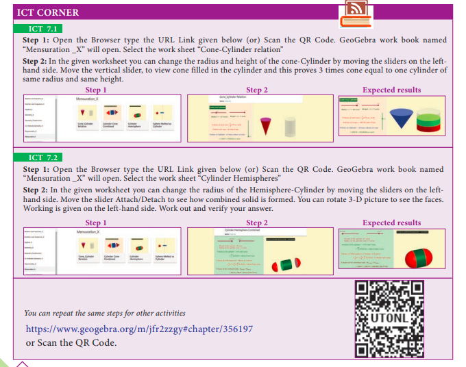



# Conversion of Solids from one shape to another with no change in Volume

Conversions or Transformations becomes a common part of our daily life. For 
example, a gold smith melts a bar of gold to transform it to a jewel. Similarly, a kid playing 
with clay shapes it into different toys, a carpenter uses the wooden logs to form different 
house hold articles/furniture. Likewise, the conversion of solids from one shape to another 
is required for various purposes.

In this section we will be learning problems involving conversions of solids from one 
shape to another with no change in volume.

**Example 7.29**  A metallic sphere of radius 16 cm is melted and recast into small spheres 
each of radius 2 cm. How many small spheres can be obtained?

**Solution**  Let the number of small spheres obtained be n.

Let r be the radius of each small sphere and R be the radius of metallic sphere.

Here, R = 16 cm, r = 2 cm

Now, n x (Volume of a small sphere) = Volume of big metallic sphere

 n (\\(\frac{4}{3}  \pi  r^{3}) =  \frac{4}{3}  \pi  R^{3}\\)

n(\\(\frac{4}{3} \pi  x 2^{3})= \frac{4}{3}  \pi  x 16^{3}\\)

 8 n= 4096  ⇒ n = 512

Therefore, there will be 512 small spheres.

**Example 7.30**  A cone of height 24 cm is made up of modeling clay. A child reshapes it in 
the form of a cylinder of same radius as cone. Find the height of the cylinder.

**Solution** Let h1 and h2 be the heights of a cone and cylinder respectively.

Also, let r be the raius of the cone.

Given that, height of the cone h1 = 24 cm; radius of the cone and cylinder r = 6 cm

Since, Volume of cylinder = Volume of cone

  \\(\pi  r^{2} h2= \frac{1}{3}  \pi  r^{2}\\) h1
 
 h2 =\\(\frac{1}{3}\\)  x h1 ⇒ h2 =
\\(\frac{1}{3}\\) × 24 = 8

Therefore, height of cylinder is 8 cm

**Example 7.31**  A right circular cylindrical container of base radius 6 cm and height 15 cm 
is full of ice cream. The ice cream is to be filled in cones of height 9 cm and base radius 3
cm, having a hemispherical cap. Find the number of cones needed to empty the container.

**Solution** Let h and r be the height and radius of the cylinder respectively.

 Given that, h = 15 cm, r = 6 cm

 ---

 Volume of the container V =  \\(\pi r^{2}\\) h cubic units.

 = \\(\frac{22}{7}\\) x 6 x 6 x 15

Let, r1 = 3 cm, h1 = 9 cm be the radius and height of the cone. 

Also, r1 = 3 cm is the radius of the hemispherical cap.

Volume of one ice cream cone =(Volume of the cone + Volume of the hemispherical cap)

 = \\(\frac{1}{3}  \pi  r1^{2} h1 + \frac{2}{3}  \pi  r1^{3}\\)

 =\\(\frac{1}{3} x \frac{22}{7} x 3 x 3 x 9 +\frac{2}{3} x \frac{22}{7}\\) x 3 x 3 x 3

 = \\(\frac{22}{7} x 9(3 + 2) = \frac{22}{7}\\) x 45

 Number of cones =\\( \frac{volume of the cylinder }{volume of one ice cream cone }\\)

Number of ice cream cones needed=\\(\frac{
\frac{22}{7} x 6 x 6 x 15}{\frac{22}{7} x 45}  \\)  = 12

Thus 12 ice cream cones are required to empty the cylindrical container.

**Exercise 7.4**

1. An aluminium sphere of radius 12 cm is melted to make a cylinder of radius 8 cm. 
Find the height of the cylinder.
2. Water is flowing at the rate of 15 km per hour through a pipe of diameter 14 cm into a 
rectangular tank which is 50 m long and 44 m wide. Find the time in which the level 
of water in the tanks will rise by 21 cm.
3. A conical flask is full of water. The flask has base radius r units and height h units, the 
water is poured into a cylindrical flask of base radius xr units. Find the height of water 
in the cylindrical flask.

---

4. A solid right circular cone of diameter 14 cm and height 8 cm is melted to form a hollow 
sphere. If the external diameter of the sphere is 10 cm, find the internal diameter.
5. Seenu’s house has an overhead tank in the shape of a cylinder. This is filled by pumping 
water from a sump (underground tank) which is in the shape of a cuboid. The sump has 
dimensions 2 m x 1.5 m x 1 m. The overhead tank has its radius of 60 cm and height 105
cm. Find the volume of the water left in the sump after the overhead tank has been 
completely filled with water from the sump which has been full, initially.
6. The internal and external diameter of a hollow hemispherical shell are 6 cm and 10 cm 
respectively. If it is melted and recast into a solid cylinder of diameter 14 cm, then find 
the height of the cylinder.
7. A solid sphere of radius 6 cm is melted into a hollow cylinder of uniform thickness. If 
the external radius of the base of the cylinder is 5 cm and its height is 32 cm, then find 
the thickness of the cylinder. 
8. A hemispherical bowl is filled to the brim with juice. The juice is poured into a 
cylindrical vessel whose radius is 50% more than its height. If the diameter is same for 
both the bowl and the cylinder then find the percentage of juice that can be transferred 
from the bowl into the cylindrical vessel.

**Exercise 7.5**

**Multiple choice questions**

1. The curved surface area of a right circular cone of height 15 cm and 
base diameter 16 cm is

(A)\\(60 \pi \\) \\(cm^{2} (B) 68\pi cm^{2} (C) 120\pi cm^{2} (D) 136\pi cm^{2}\\)

2. If two solid hemispheres of same base radius r units are joined together along their 
bases, then curved surface area of this new solid is

(A) 4 \\(\pi r^{2} sq. units (B) 6 \pi r^{2} sq. units (C) 3 \pi r^{2} sq. units (D) 8 \pi r^{2}\\) sq. units

3. The height of a right circular cone whose radius is 5 cm and slant height is 13 cm will be

(A) 12 cm (B) 10 cm (C) 13 cm (D) 5 cm

4. If the radius of the base of a right circular cylinder is halved keeping the same height, 
then the ratio of the volume of the cylinder thus obtained to the volume of original 
cylinder is

(A) 1:2 (B) 1:4 (C) 1:6 (D) 1:8

5. The total surface area of a cylinder whose radius is 1
3 of its height is
(A)
 \\(\frac{9 \pi h^{2}}{8} sq.units (B) 24  \pi h^{2}\\) sq.units (C)
 \\(\frac{8 \pi h^{2}}{9} \\) sq.units (D) \\(\frac{56 \pi h^{2}}{9} \\) sq.units

6. In a hollow cylinder, the sum of the external and internal radii is 14 cm and the 
width is 4 cm. If its height is 20 cm, the volume of the material in it is 

(A) 5600 \\(\pi  cm^{3} (B) 1120 \pi  cm^{3} (C) 56 \pi  cm^{3} (D) 3600 \pi  cm^{3}\\)

---

7. If the radius of the base of a cone is tripled and the height is doubled then the volume is

(A) made 6 times (B) made 18 times (C) made 12 times (D) unchanged

8. The total surface area of a hemi-sphere is how much times the square of its radius.

(A)  \\(\pi  (B) 4\pi  (C) 3\pi  (D) 2\pi\\) 

9. A solid sphere of radius x cm is melted and cast into a shape of a solid cone of same 
radius. The height of the cone is 

(A) 3x cm (B) x cm (C)4x cm (D)2x cm

10. A frustum of a right circular cone is of height 16cm with radii of its ends as 8cm and 
20cm. Then, the volume of the frustum is 

(A) 3328 \\(\pi  cm^{3} (B) 3228 \pi  cm^{3} (C) 3240 \pi  cm^{3} (D) 3340 \pi  cm^{3}\\)

11. A shuttle cock used for playing badminton has the shape of the combination of 

(A) a cylinder and a sphere (B) a hemisphere and a cone
(C) a sphere and a cone (D) frustum of a cone and a hemisphere

12. A spherical ball of radius r
1 units is melted to make 8 new identical balls each of 
radius r2 units. Then r1 : r2 is

(A) 2:1 (B) 1:2 (C) 4:1 (D) 1:4

13. The volume (in cm3) of the greatest sphere that can be cut off from a cylindrical log 
of wood of base radius 1 cm and height 5 cm is 

(A) \\(\frac{4}{3} \pi\\)  (B)
\\(\frac{10}{3} \pi  (C) 5 \pi\\)  (D)
\\(\frac{20}{3} \pi\\) 

14. The height and radius of the cone of which the frustum is a part are h1 units and r
1
units respectively. Height of the frustum is h2 units and radius of the smaller base is 
r2 units. If h2:h1 = 1 :2 then r2:r1  is 

(A) 1 :3 (B) 1 :2 (C) 2: 1 (D) 3 :1

15. The ratio of the volumes of a cylinder, a cone and a sphere, if each has the same 
diameter and same height is

(A) 1:2:3 (B) 2:1:3 (C) 1:3:2 (D) 3:1:2

**Unit Exercise - 7**

1. The barrel of a fountain-pen cylindrical in shape, is 7 cm long and 5 mm in diameter. 
A full barrel of ink in the pen will be used for writing 330 words on an average. How 
many words can be written using a bottle of ink containing one fifth of a litre?
2. A hemi-spherical tank of radius 1.75 m is full of water. It is connected with a pipe 
which empties the tank at the rate of 7 litre per second. How much time will it take 
to empty the tank completely?
3. Find the maximum volume of a cone that can be carved out of a solid hemisphere of 
radius r units.
4. An oil funnel of tin sheet consists of a cylindrical portion 10 cm long attached to a 
frustum of a cone. If the total height is 22 cm, the diameter of the cylindrical portion 

---

be 8 cm and the diameter of the top of the funnel be 18 cm, then find the area of the 
tin sheet required to make the funnel.

5. Find the number of coins, 1.5 cm in diameter and 2 mm thick, to be melted to form 
a right circular cylinder of height 10 cm and diameter 4.5 cm.

6. A hollow metallic cylinder whose external radius is 4.3 cm and internal radius is 1.1
cm and whole length is 4 cm is melted and recast into a solid cylinder of 12 cm long. 
Find the diameter of solid cylinder.

7. The slant height of a frustum of a cone is 4 m and the perimeter of circular ends are 
18 m and 16 m. Find the cost of painting its curved surface area at Rs100 per sq. m.

8. A hemi-spherical hollow bowl has material of volume \\(\frac{436\pi}{3}\\) cubic cm. Its external 
diameter is 14 cm. Find its thickness.

9. The volume of a cone is 1005 \\(\frac{5}{7}\\)
 cu. cm. The area of its base is \\(201 \frac{1}{7}\\)
 sq. cm. Find the 
slant height of the cone.

10. A metallic sheet in the form of a sector of a circle of radius 21 cm has central angle 
of 216°. The sector is made into a cone by bringing the bounding radii together. Find 
the volume of the cone formed.

