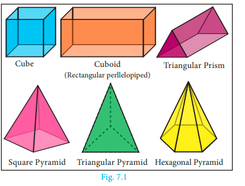

[comment]: <> (katex Header)


# Mensuration

“Nature is an infinite sphere of which the centre is everywhere and 
the circumference nowhere”.
                                               
                                         - Blaise Pascal

  Pappus
290 - 350 AD(CE) 

   Pappus, born at Alexandria, Egypt is the last of the great Greek 
geometers. Pappus major work ‘Synagoge’ or ‘The Mathematical 
Collection’ is a collection of mathematical writings in eight books. 

He described the principles of levers, pulleys, wedges, axles 
and screws. These concepts are widely applied in Physics and 
modern Engineering Science.

# Introduction

The ancient cultures throughout the world sought the idea of measurements for 
 satisfying their daily needs.

For 
example, they had to know how 
much area of crops needed to be 
grown in a given region; how 
much could a container hold? 
etc. These questions were very 
important for making decisions 
in agriculture and trade. They 
needed efficient and compact 
way of doing this. It is for this 
reason, mathematicians thought 
of applying geometry to real life 
situations to attain useful results. 
This was the reason for the origin 
of mensuration. Thus, mensuration can be thought as applied geometry.

---

We are already familiar with the areas of plane figures like square, rectangle, triangle, 
circle etc. These figures are called 2-dimensional shapes as they can be drawn in a plane. 
But most of the objects which we come across in our daily life cannot be represented in a 
plane. For example, tubes, water tanks, bricks, ice-cream cones, football etc. These objects 
are called solid shapes or 3-dimensional shapes.

We often see solids like cube, cuboid, prism and pyramid. For three dimensional 
objects measurements like surface area and volume exist.

In this chapter, we shall study about the surface area and volume 
of some of the standard solid shapes such as cylinder, cone, sphere, 
hemisphere and frustum.