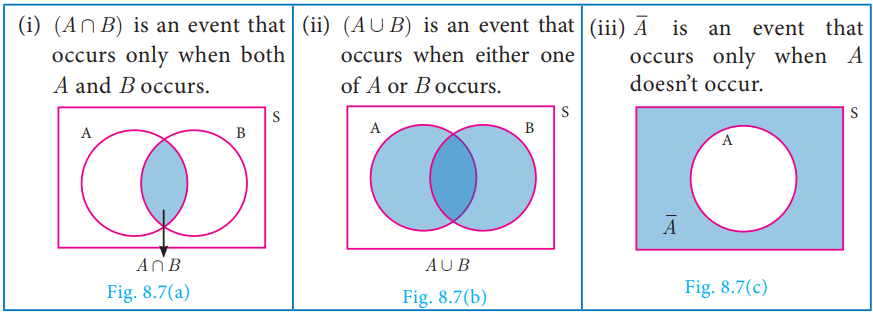
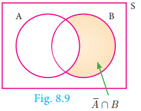

# Algebra of Events 

In a random experiment, let S be the sample space. Let A \subseteq S and B \subseteq S be the events in _S._ We say that

**Note**

A \cap \bar{A} = \phi

A \cup \bar{A} = S

If _A, B_ are mutually exclusive events, then P(A \cup B) = P(A) + P(B)

_P_ (Union of mutually exclusive events)= \Sigma( Probability of events)

**Thorem 1** 

If _A_ and _B_ are two events associated with a random experiment, then prove that

1. P(A \cap \bar{B}) = P(only _A_)=P(A)-P(A \cap B)

2. P(\bar{A} \cap B) = P(only _B_)=P(B)-P(A \cap B)

**Proof** 

1. By Distributive property of sets,
    1. (A \cap B) \cup (A \cap \bar{B}) = A \cap (B \cup \bar{B}) = A \cap S = A
    2. (A \cap B) \cap (A \cap \bar{B}) = A \cap (B \cap \bar{B}) = A \cap \phi = \phi

Therefore, the events A \cap B and A \cap \bar{B} are mutually exclusive whose union is _A_. 

Therefore, P(A) = P[(A \cap B) \cup (A \cap \bar{B})]

P(A) = P(A \cap B) + P(A \cap \bar{B})

Therefore, P(A \cap \bar{B}) = P(A) - P(A \cap B)

That is, P(A \cap \bar{B}) = P(only _A_)=P(A)-P(A \cap B)

2. By Distributive property of sets, 
    1. (A \cap B) \cup (\bar{A} \cap B) = (A \cup \bar{A}) \cap B = S \cap B = B
    2. (A \cap B) \cap (\bar{A} \cap B) = (A \cap \bar{A}) \cap B = \phi \cap B = \phi

Therefore, the events A \cap B and \bar{A} \cap B are mutually exclusive whose union is _B_.

P(B) = P[(A \cap B) \cup (\bar{A} \cap B)]

P(B) = P(A \cap B) + P(\bar{A} \cap B)

Therefore, P(\bar{A} \cap B) = P(B) - P(A \cap B)

That is, P(\bar{A} \cap B) = P(only _B_)=P(B)-P(A \cap B)

**Progress Check**

1. _P_(only _A_)= \_\_\_\_\_\_\_\_. 

2. P(\bar{A} \cap B){1} = \_\_\_\_\_\_\_\_.

3. A \cap B and A \cap \bar{B} are \_\_\_\_\_\_\_ events.

4. P(\bar{A} \cap \bar{B}) = \_\_\_\_\_\_\_\_.

5. If _A_ and _B_ are mutually exclusive events then P(A \cap B) = \_\_\_\_\_\_\_.

6. If P(A \cap B)=0.3, P(\bar{A} \cap B)=0.45 then P(B) =\_\_\_\_\_\_\_.